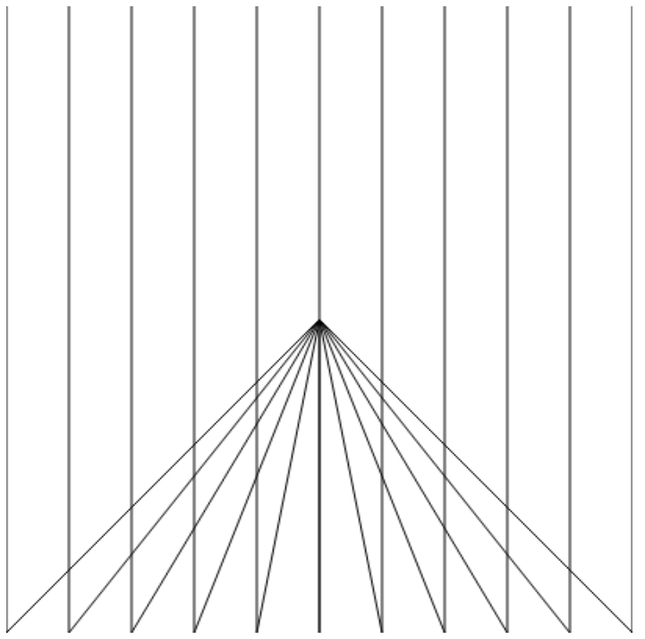

# Fast* - del 2
*Ikke faktisk fasit. Har bare kjørt koden og sett om det funket som forventet*
*OBS! Dette er min kode, altså nødvendigvis ikke beste løsning i det hele tatt.*

---

## Oppgave 2.1
Skriv ferdig følgende funksjoner:

a)  En funksjon som returnerer gjennomsnittet av tre tall
            function gjennomsnitt(tall1,tall2,tall3)
 
b) En funksjon som returnerer antallet 0-er som forekommer i en array med heltall
           function antallNuller(array)
 
c) En funksjon som returnerer antallet ord i en tekst
          function antallOrd(tekst)

### Svar
```
    function gjennomsnitt(tall1, tall2, tall3) {
        return (tall1+tall2+tall3)/3;
    }

    function antallNuller(array) {
        var count = 0;
        
        for (var i = 0; i < array.length; i++) {
            if (array[i] === 0) {
                count++;
            }
        }
        
        return count;
    }

    function antallOrd(tekst) {
        return (tekst.split(" ")).length;
    }
```

---

## Oppgave 2.2
Du har to arrayer med ord. Skriv kode som skriver ut alle forekomster av ord i den første arrayen satt sammen med alle forekomster av ord i den andre. Arrayene under er eksempel-arrayer. Du må skrive kode som også håndterer andre ord og andre lengder på arrayene.

var arr1 = ["bil","buss","båt"];

var arr2 = ["vrak","henger","tur"];

Skal gi utskriften:
 
bilvrak
bilhenger
biltur
bussvrak
busshenger
busstur
båtvrak
båthenger
båttur

### Svar
```
window.onload = function() {
    var arr1 = ["Bilær", "Båtær"];
    var arr2 = ["Tutær","Bråkær"];

    // Join med <br> for å få de unner hverandre...
    document.getElementById("utskrift").innerHTML = writeAllCombos(arr1, arr2).join("<br>");
}

// Kunne alternativt hatt en recursive funksjon, men stoler ikke nok på meg selv
// til å skrive den feilfritt på første forsøk
function writeAllCombos(arr1, arr2) {
    var allCombos = [];

    for (var i = 0; i < arr1.length; i++) {
        for (var j = 0; j < arr2.length; j++) {
            allCombos.push(arr1[i] + arr2[j]);
        }
    }
    
    return allCombos;
}
```

---

## Oppgave 2.3


I denne oppgaven kan du gå ut i fra at følgende `<canvas>`-tagg står i HTML-dokumentet
`<canvas id="tegneflate" width="400" height="400"></canvas>`
Ved hjelp av løkker, produser følgende grafikk (du ser her hele canvaset)
(bilde er illustrasjon til oppgaven)
### Svar
```
    window.onload = function() {
        var canvas = document.getElementById("tegneflate");
        drawMyMasterpiece(canvas, 11, "#000", "#fff");
    }

    function drawMyMasterpiece(canvas, lines, color, background) {
        var ctx = canvas.getContext("2d"),
            width = canvas.offsetWidth,
            height = canvas.offsetHeight;
        
        // Make bg
        ctx.beginPath();
        ctx.fillStyle = background;
        ctx.fillRect(0, 0, width, height);
        ctx.closePath();
        
        // Make lines
        ctx.beginPath();
        ctx.strokeStyle = color;
        for (var i = 0; i < lines; i++) {
            ctx.moveTo(width/2, height/2);       // Move to center
            ctx.lineTo((width/lines)*i, height); // Draw line to bottom
            ctx.lineTo((width/lines)*i, 0);      // Draw line to top
        }
        ctx.stroke();
        ctx.closePath();
    }
```